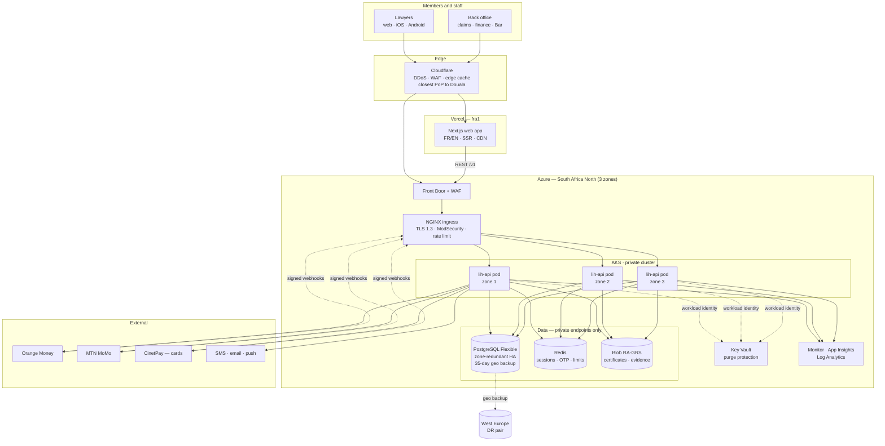
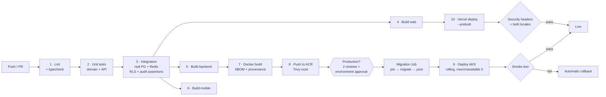
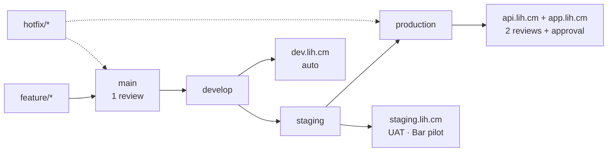
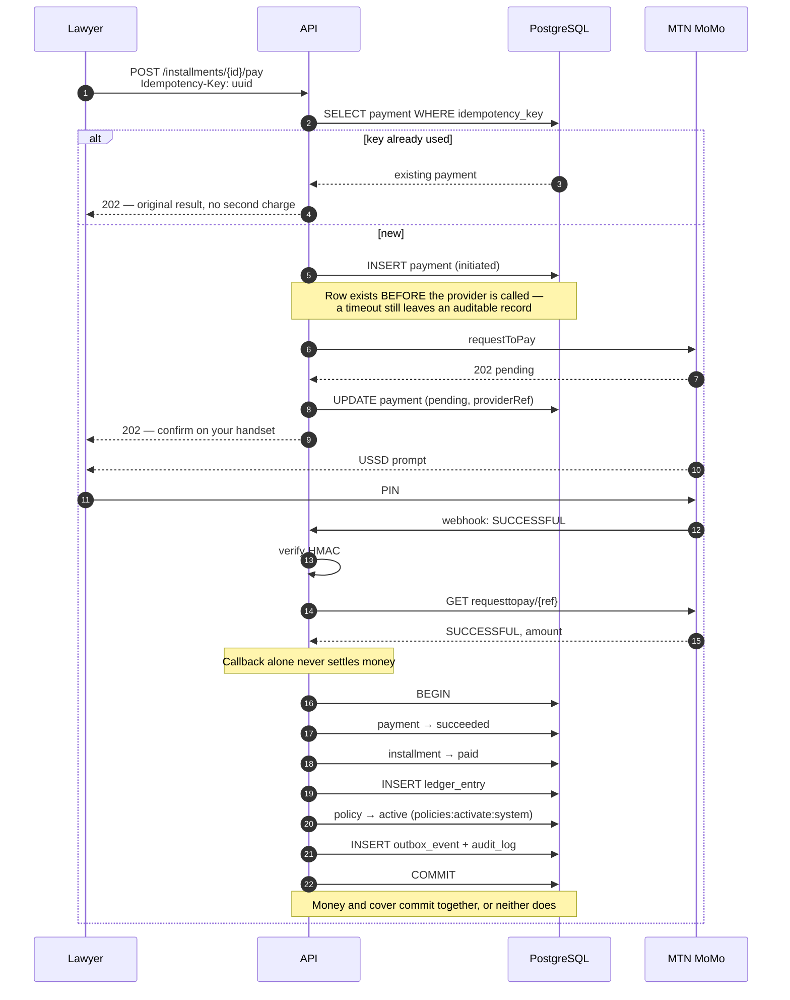
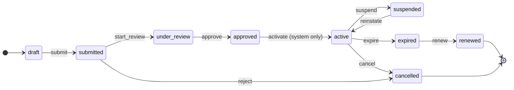

# Deployment architecture

## 1. Production topology



## 2. CI/CD pipeline



Migrations run **before** the new pods and abort the deploy on failure —
no new code starts against a schema it cannot use.

## 3. Branch and environment flow



## 4. Repository structure

```
lawyers-insurance-hub/
├── backend/                    NestJS API — 12 service-shaped modules
│   ├── src/
│   │   ├── common/             prisma · auth guards · crypto · audit · filters
│   │   ├── config/             environment validation (fails fast at boot)
│   │   ├── i18n/{en,fr}/       bilingual API messages
│   │   └── modules/            auth · onboarding · catalogue · policies
│   │                           claims · payments · health
│   ├── prisma/
│   │   ├── schema.prisma       28 tables
│   │   ├── sql/                RLS · partitioning · uuidv7 · constraints
│   │   └── seed.ts             roles · permissions · catalogue · rating tables
│   ├── scripts/apply-sql.js
│   └── Dockerfile              multi-stage, non-root, distroless-style
│
├── frontend-web/               Next.js 15 · App Router · next-intl
│   ├── src/lib/api-client.ts   single-flight refresh · bigint money
│   └── messages/{en,fr}.json
│
├── mobile-app/                 Flutter — Android + iOS
│   └── lib/core/               money.dart · api_client.dart (keystore, offline)
│
├── desktop-app/                Electron — Windows + macOS, auto-update
│
├── packages/domain/            Pure logic, no framework, no I/O
│   └── src/                    money · rating · state machines · RBAC
│
├── infrastructure/
│   ├── azure/provision.sh      full estate, idempotent
│   ├── kubernetes/             deployment · service · ingress · secrets · job
│   └── terraform/
│
├── docs/
│   ├── adr/                    decision records
│   └── guides/                 github · vercel · azure · testflight · DR · runbook
│
├── scripts/
└── .github/workflows/          ci · deploy-azure · deploy-vercel · release-mobile · security
```

## 5. Request path — paying a premium

The flow with the strictest correctness requirements in the system.



## 6. Where the state machines live



`activate` carries `policies:activate:system`, a permission held by no human
role. Only the payment settlement transaction can perform it — which is how
"cover never starts before money arrives" is enforced structurally rather than
by convention.
